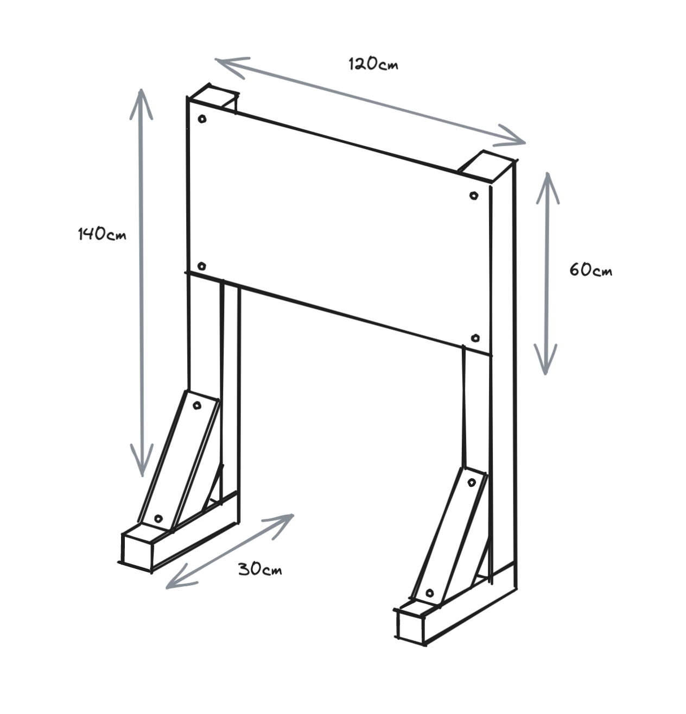
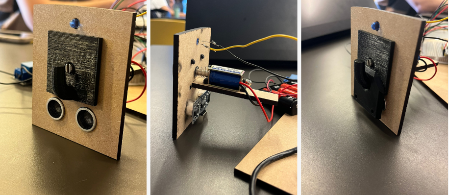
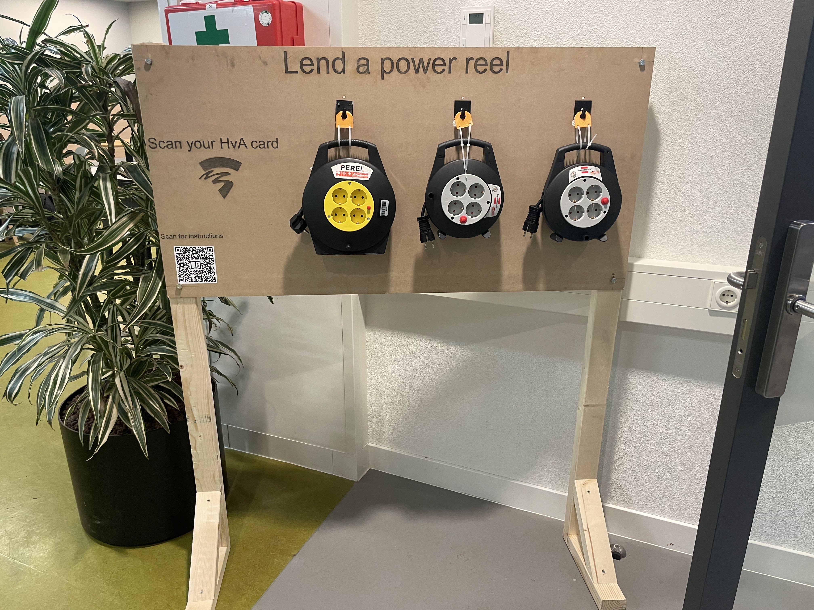

# Iot Power!

During the final semester of my third year, I chose Internet of Things (IoT) as my minor because I wanted to engage
in something more than just typing behind my laptop 👩🏻‍💻. I had so much fun working on this project, all thanks to my
fun teammates!

## The project

At my university, a lot of power reels are borrowed to students who don't have direct access to a power outlet.
The problem is that these power reels are often not returned on time. This project aims to solve this problem
by creating a system that can track which student is borrowing which power reel.

### Key features

When a student wants to borrow a power reel,
they can check out the power reel by scanning their student card. When they are done, they can check in the power reel
to return it. This way, the system can keep track of who is borrowing the power reels. There is also a web interface
where the administrator can see who has borrowed which power reel, along with their student email.

## Software

This was my first time writing in C++. Using Clion as my IDE, I was able to write the code for the ESP32.
The reason we chose Clion instead of Arduino IDE was because of PlatformIO. PlatformIO is an open-source ecosystem for
IoT development. It supports more than 900 embedded boards and works with Arduino, ESP-IDF, and other frameworks.
During the project, I learned how to code efficiently in C++, as code optimization is crucial when working with embedded
systems. There were a lot of trial and errors, as well as debugging and testing. My knowledge of C++ has improved,
but I still have a lot to learn.

## Physical Design & Embedded
This was the most exciting part of the project, as I got to work with my hands. To create a stand, we used wood for easy assembly. We have decided to make the stand 140cm tall. Using nuts and bolts,
we have made the board a little bit more sturdy, so it does not wobble when the power reels are being taken off.

To hang the power reels, we used 3D printed hooks. The hooks were designed to hold the power reels on a hanger. The
hanger made so that the power reels can be easily taken off and put back on. The final hook design was made along with
two holes
cut out for the ultrasonic sensor. The sensor is used to measure the distance between the power reel and the hook. If it
detects that the power reel is close enough, the lock will close, indicating that the power reel is returned. When
the sensor detects that the power reel is close enough, the lock will open, allowing the power reel to be taken off.

The lock mechanism is made using a solenoid. The solenoid was still a bit too short, allowing students to take the power
reel
without scanning their student card. To solve this, we needed an extension. My teammate was responsible for this part,
and
after a few iterations, we decided to use a piece of a tie wrap to extend the solenoid. Surprisingly, the tie wrap was
strong enough not to bend if you forced to take the power reel off.

## The result
After a few weeks of hard work, we were able to present our project to on a Digital Creators Fair at school, where
students could showcase their projects to each other. We received a lot of positive feedback and got the most 
votes for "Most Useful Product". It was so much fun to work on this project, it felt refreshing to work on something
physical instead of just coding behind a laptop.

